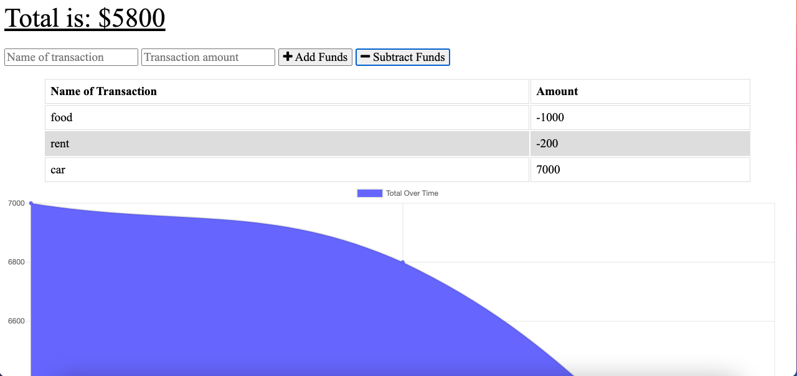

# Budget_Tracker

* [About-project](#Description)
* [Installation](#Installation)
* [License](#License)
* [Contributor](#Contributor)
* [Email-adress](#Email)
* [LinkedIn-profile](#LinkedIn-profile)
* [GitHub-profile](#GitHub-profile)

   
### About the project:
A simple app that allows user to control money budget. User can add/substract funds, name the transaction. Data is stored in Mongo DB Database. 

Screenshots: 

## Installation and Setup Instructions

To view this locally, clone this repository. You will need `node`, `npm`, and `MongoDB` installed globally on your machine. 

Installation:

`npm install`  

To Start Server:

`npm start`  

To Visit App:

`localhost:3001`  

---

Deployed App: https://hidden-shore-62619.herokuapp.com/

### License:
MIT

### Contributor:
Sandu Corobcenco

### Email adress:
corobcenco.sandu@gmail.com

### LinkedIn profile:
https://www.linkedin.com/in/sandu-corobcenco-527131165/

### GitHub profile:
https://github.com/SanduCorobcenco
